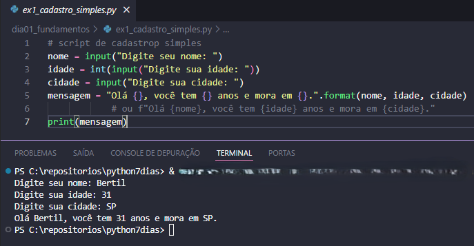
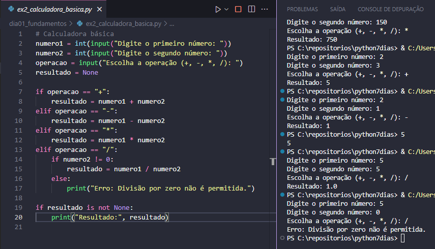
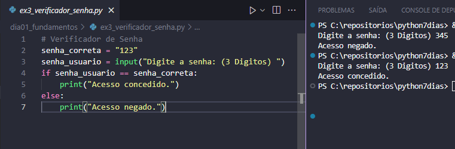
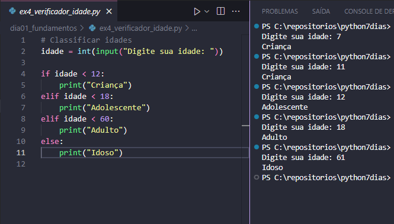

# 📘 Dia 1 – Fundamentos

### 📌 Conteúdos estudados
- Variáveis e tipos básicos (`int`, `float`, `str`, `bool`)
- Entrada e saída de dados (`input`, `print`)
- Estruturas condicionais (`if`, `elif`, `else`)
- Operadores relacionais e lógicos (`==`, `!=`, `>`, `<`, `and`, `or`)

---

### 📝 Exercícios práticos
1. **Cadastro simples**  
   - Pergunta nome, idade e cidade → retorna mensagem personalizada.
   **Saída esperada:**
   

2. **Calculadora básica**  
   - Soma, subtração, multiplicação e divisão (com validação de divisão por zero).
   **Saída esperada:**
   

3. **Verificador de senha**  
   - Confere se a senha digitada é igual à senha correta.
   **Saída esperada:**
   

4. **Classificação de idades**  
   - Retorna: Criança, Adolescente, Adulto ou Idoso.
   **Saída esperada:**
   
---

### ✅ Aprendizados do dia
- Como declarar variáveis e manipular tipos.
- Diferença entre cálculo e exibição (separar lógica de `print`).
- Uso de condicionais para tomada de decisão.
- Boas práticas: simplificar condições e usar **f-strings**.
